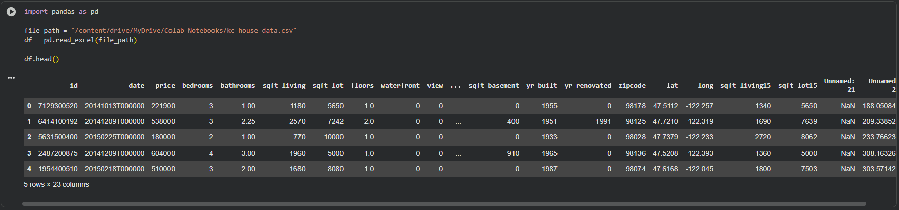
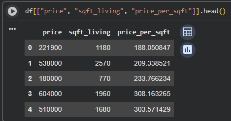

## This project predicts housing price per square foot using real home sales data from King County, Washington. I’m using simple tabular features like square footage, bedrooms, bathrooms, and year built to model how efficiently space is priced.

## Author: Ethan Thomas Eubanks
[GitHub Repository]([https://github.com/ethaneubanks/housing_price_predictor](https://github.com/ethaneubanks) 

### Example Input and Output
| Input | Output |
|-------|--------|
|  |  |
